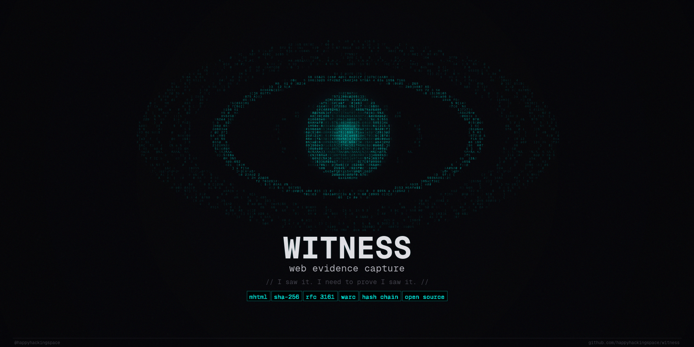

<div align="center">



**I saw it. I need to prove I saw it.**

Web pages disappear. Social media posts get deleted. Evidence vanishes.
Witness captures everything you see, preserves it with cryptographic integrity, and lets you prove it was real.

</div>

> [!Important]
> **This project is in active development.** Witness is a free, open-source Chrome extension for web evidence capture. No companion app, no subscription, no vendor lock-in. Everything runs locally in your browser.

---

## Who is this for?

**OSINT investigators** who need to document every step of an online investigation with an auditable trail. Automatically log every page you visit, track selectors across captures, and export court-ready evidence packages.

**Journalists** who chase stories across websites and social media that can disappear at any moment. Every source is captured, timestamped, and preserved. No more broken links in your notes.

**Legal professionals** who need to present web-based evidence in court. SHA-256 hash chains and RFC 3161 trusted timestamps provide cryptographic proof that evidence has not been tampered with.

**Cybersecurity analysts** who research threat actors, phishing campaigns, and infrastructure across the web. Preserve pages, track indicators across captures, and export to standard formats.

**Human rights researchers** who document abuses that governments and platforms try to erase. Capture the evidence before it disappears, organize it by case, and generate reports for legal proceedings.

**Anyone** who has ever thought "I should have saved that page."

---

## Features

### Automatic capture

Every page you visit while recording is captured automatically. MHTML preserves the full page (HTML, CSS, images, scripts). A viewport or full-page screenshot is taken alongside it. No manual "save" button. Just browse.

- Full-page screenshots via Chrome DevTools Protocol
- Right-click "Capture this page" context menu
- Domain allowlist/blocklist for selective capture
- Duplicate detection (skip if URL + content hash unchanged)

### Forensic integrity

Every capture is hashed with SHA-256. Each hash links to the previous one, forming a tamper-evident chain. Break one link and the entire chain flags it. RFC 3161 trusted timestamps from FreeTSA.org and DigiCert provide third-party proof of when evidence was captured.

- SHA-256 content hash, screenshot hash, and evidence hash per capture
- Hash chain linking every capture to the previous one
- RFC 3161 trusted timestamps (automatic, non-blocking)
- One-click chain verification in Settings

### Cases and organization

Group captures into investigation cases. Switch between cases from the header. Tag captures, add notes, and filter by any combination.

- Active case switching from a global dropdown
- Freeform tags and notes on any capture
- Search across all captured page content and metadata
- Timeline view grouped by day

### Selectors and smart detection

Define keywords, usernames, emails, phone numbers, crypto addresses, or custom regex patterns. Every captured page is automatically scanned against all active selectors. Findings are aggregated across your entire evidence set.

- Keyword, regex, and preset selector types
- Auto-detection of emails, phones, crypto wallets, IPs, social handles
- Findings view showing which entities appear on which pages
- Hit indicators on every capture in the evidence browser

### Annotations

Mark up screenshots without altering the original evidence. Highlight key areas, redact sensitive information, draw arrows, circle elements. Annotations are stored separately so the original screenshot remains forensically intact.

- Highlight, redact, arrow, and circle tools
- 5 color options with undo and clear
- Original evidence always preserved

### Export

Take your evidence anywhere. ZIP packages for file-based workflows. WARC (ISO 28500) for archives and legal proceedings. HTML/PDF reports with screenshots, hashes, timestamps, and investigator notes.

- Single capture, case-level, or full export
- ZIP with MHTML + screenshot + metadata + SHA256SUMS manifest
- WARC 1.1 (ISO 28500) standard web archive format
- HTML reports with print-friendly CSS for PDF output

---

## Installation

### Prerequisites

- Node.js 20+
- pnpm 9+

### Build from source

```bash
git clone https://github.com/HappyHackingSpace/witness.git
cd witness
pnpm install
pnpm build
```

Then load in Chrome:

1. Open `chrome://extensions/`
2. Enable **Developer mode**
3. Click **Load unpacked**
4. Select the `.output/chrome-mv3/` directory

---

## How it works

```
  Click icon        Toggle REC        Browse            Organize          Export
 ┌──────────┐    ┌──────────────┐   ┌──────────┐    ┌──────────────┐   ┌──────────┐
 │ Open side │───>│ Start/pause  │──>│ Pages are │──>│ Cases, tags, │──>│ ZIP,WARC │
 │   panel   │    │  recording   │   │ captured  │   │ notes,search │   │ or Report│
 └──────────┘    └──────────────┘   │ with hash │   └──────────────┘   └──────────┘
                                     │ + timestamp│
                                     └──────────┘
```

All data stays in your browser. No external servers. No accounts. No tracking. The only outbound requests are RFC 3161 timestamp queries to public TSA servers, and those contain only a SHA-256 hash, not your data.

---

## Architecture

```
┌──────────────────────────────────────────────────────────────┐
│                 Witness Extension (Chrome MV3)                │
│                                                               │
│  ┌──────────────┬──────────────┬───────────────────────────┐ │
│  │Service Worker │Content Script│  Side Panel (Svelte 5)    │ │
│  │              │              │                            │ │
│  │ Navigation   │ Selector     │  Dashboard                │ │
│  │ tracking     │ scanning     │  Evidence browser          │ │
│  │ MHTML capture│ Smart        │  Cases                     │ │
│  │ Screenshots  │ detection    │  Selectors / Findings      │ │
│  │ Hash chain   │              │  Timeline                  │ │
│  │ RFC 3161 TSA │              │  Annotations               │ │
│  │ Dedup        │              │  Reports                   │ │
│  │ Context menu │              │  Settings                  │ │
│  │ Domain rules │              │                            │ │
│  └──────────────┴──────────────┴───────────────────────────┘ │
│                             │                                 │
│             ┌───────────────┼───────────────┐                │
│             ▼               ▼               ▼                │
│        IndexedDB      chrome.storage   chrome.pageCapture    │
│   (captures, cases,    (settings,       (MHTML snapshots)    │
│    selectors, blobs)    domain rules)                         │
└──────────────────────────────────────────────────────────────┘
```

| Component | Technology |
|-----------|-----------|
| Language | TypeScript |
| Build | Vite + WXT |
| Manifest | V3 |
| Side Panel | Svelte 5 |
| Storage | IndexedDB (idb) + chrome.storage |
| Hashing | Web Crypto API (SHA-256) |
| Compression | fflate |
| Timestamps | RFC 3161 (FreeTSA, DigiCert) |

```
witness/
├── src/
│   ├── entrypoints/       # background.ts, sidepanel/, content.ts
│   ├── components/        # Svelte 5 UI components
│   ├── lib/               # Store, export, search, annotations, reports
│   └── shared/            # Hash functions, types, interfaces
└── scripts/               # Build utilities
```

---

## Development

```bash
pnpm install          # Install dependencies
pnpm dev              # Dev server with hot reload
pnpm build            # Production build
pnpm test             # Run tests
pnpm typecheck        # Type check
pnpm lint             # Lint
pnpm format           # Format
```

---

## Community

- [Discord](https://discord.happyhacking.space)
- [GitHub Issues](https://github.com/HappyHackingSpace/witness/issues)

Built at [Happy Hacking Space](https://happyhacking.space), Amed.

## Inspired by

- [Hunchly](https://hunch.ly)

---

## License

[MIT](LICENSE)
